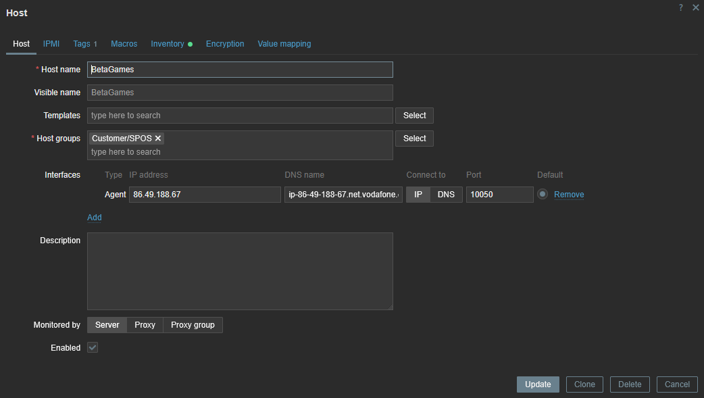

[](https://classroom.github.com/a/HlDpWB5G)

# Má práce



Exportovaný Json:
```json
{
    "zabbix_export": {
        "version": "7.0",
        "host_groups": [
            {
                "uuid": "ec50fa856fa542bbba85796d423c2e92",
                "name": "Customer/SPOS"
            }
        ],
        "hosts": [
            {
                "host": "BetaGames",
                "name": "BetaGames",
                "groups": [
                    {
                        "name": "Customer/SPOS"
                    }
                ],
                "interfaces": [
                    {
                        "ip": "86.49.188.67",
                        "dns": "ip-86-49-188-67.net.vodafone.cz",
                        "interface_ref": "if1"
                    }
                ],
                "tags": [
                    {
                        "tag": "OS",
                        "value": "Linux"
                    }
                ],
                "inventory_mode": "AUTOMATIC"
            }
        ]
    }
}
```

# Stučný postup

Lokální příprava:
- Smazal jsem z projektu složku `.\Ubuntu`.
- Vytvořil jsem vlastní složku pod názvem `.\DietPi`.
- Initializoval jsem si základná **Vagrantfile** pomocí `vagrant.exe init dietpi`.
- Přidal jsem skripty na instalaci a configuraci Zabbix agenta.
- Testoval jsem zda vše funguje.

Po navázání spojení:
- Přešel jsem do `Data collection > Hosts > BetaGames` v Zabbix configuraci na adrese `https://enceladus.pfsense.cz`
- Zde jsem pořídil snímek obrazovky (který můžete vidět kousek nahoře v tomto dokumentu).
- Poté jsem zavřel okno, které se objevilo.
- Zaškrtl jsem políčko vedle **BetaGames**.
- Dole se umožnila možnost exportovat jako Json (který také vidíte o kus nahoře).
- Nakonec jsem upravil tento README.md a odevzdal práci jako hotovou.
